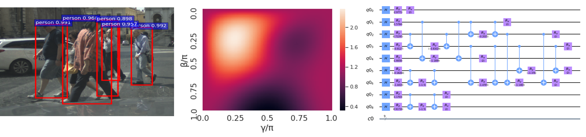
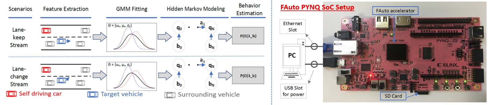

<article id="projects" class="panel">
    <header>
        <h2>Projects</h2>
    </header>
    

        I'm interested in autonomous driving, robotics, machine learning, and computer vision.
    

    

    <section>
        

            <header>
                <h3>Conference Papers</h3>
            </header>
            

                <a href="https://jundeli.github.io/projects/" target="_blank" style="color:#aaaaaa;text-decoration:none">
                    Hierarchical Improvement of Quantum Approximate Optimization Algorithm for Object Detection </a>
                <strong>Junde Li</strong>, Mahabubul Alam, Abdullah Ash-Saki, Swaroop Ghosh 
                <i>ISQED 2020</i>&ensp;&ensp;
                
                &ensp;
                  
                
            

            

            

                <a href="https://jundeli.github.io/projects/" target="_blank" style="color:#aaaaaa;text-decoration:none">
                FAuto: An Efficient GMM-HMM FPGA Implementation for Behavior Estimation in Autonomous Systems </a>
                <strong>Junde Li</strong>, Navyata Gattu, Swaroop Ghosh 
                <i>TOADES (Under Review)</i>&ensp;&ensp;
                
                &ensp;
                  
                
            

        

    </section>
    <section>
        

            <header>
                <h3>Conference Papers</h3>
            </header>
            

                <a href="https://jundeli.github.io/projects/" target="_blank" style="color:#aaaaaa;text-decoration:none">
                FAuto: An Efficient GMM-HMM FPGA Implementation for Behavior Estimation in Autonomous Systems </a>
                <strong>Junde Li</strong>, Navyata Gattu, Swaroop Ghosh 
                <i>TOADES (Under Review)</i>&ensp;&ensp;
                
                &ensp;
                  
                
            

        

    </section>
</article>
